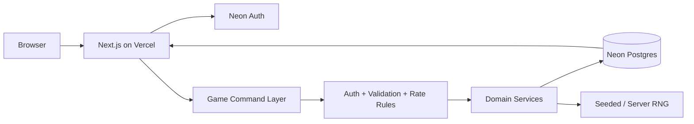

# 03 — Technical Architecture

## Recommended architecture

Project Ashfall Ver 2.0 should use a single Next.js application on Vercel until measured load proves the need to split services.

### Frontend
- Next.js App Router
- React
- TypeScript
- Tailwind CSS
- server-rendered shell where useful
- client components only for interactive map/panels

### Backend
- Next.js Route Handlers and server-side domain services
- Vercel Node.js Functions
- explicit command handlers for game mutations

### Database
- Neon Postgres
- pooled connection for serverless traffic
- Drizzle ORM for game-domain tables
- SQL migrations committed to source control

### Authentication
- Neon Auth
- email/password in Phase 1
- server-side session verification on protected routes and mutations

### Validation
- Zod

### Testing
- Vitest
- Playwright
- database integration tests
- deterministic seeded tests for game RNG

### Balance simulation
- Python
- CSV/JSON/Markdown reports
- fixed seeds
- thousands to millions of simulated events offline

## Why not rebuild the old backend architecture immediately?

The earlier implementation used a separated frontend/backend stack with WebSockets. Ver 2.0 does not need that complexity at Phase 1.

This game is primarily asynchronous and command-driven. Vercel Functions plus Postgres are sufficient for:

- auth
- base provisioning
- grid movement
- resource claims
- cave resolution
- tool rewards
- troop assignment
- discrete combat

Realtime features can be introduced later behind a transport boundary.

## Runtime diagram



## Suggested source layout

```text
src/
├── app/
│   ├── (auth)/
│   │   ├── login/
│   │   └── register/
│   ├── game/
│   └── api/
│       └── game/
├── components/
│   ├── auth/
│   ├── game/
│   └── ui/
├── db/
│   ├── schema/
│   ├── migrations/
│   ├── repositories/
│   └── client.ts
├── lib/
│   ├── auth/
│   ├── validation/
│   ├── security/
│   └── ids/
├── game/
│   ├── config/
│   ├── domain/
│   ├── services/
│   ├── world/
│   ├── economy/
│   ├── caves/
│   ├── tools/
│   ├── troops/
│   └── combat/
└── tests/
```

## Layer rule

```text
UI
  -> route/server boundary
  -> authentication
  -> Zod validation
  -> domain service
  -> repository/transaction
  -> DTO
  -> UI
```

UI components do not import database clients.

## Domain service examples

- `ensurePlayerProvisioned()`
- `allocateBaseSpawn()`
- `getPlayerSnapshot()`
- `materializeChunk()`
- `movePlayer()`
- `collectResource()`
- `enterCave()`
- `resolveCave()`
- `equipTool()`
- `startExpedition()`
- `resolveCombat()`

## Stable game error codes

- `AUTH_REQUIRED`
- `PLAYER_NOT_PROVISIONED`
- `PLAYER_NOT_ACTIVE`
- `INVALID_COMMAND`
- `ACTION_REPLAYED`
- `INSUFFICIENT_ENERGY`
- `INSUFFICIENT_METAL`
- `BASE_SPAWN_FAILED`
- `TARGET_OUT_OF_RANGE`
- `BLOCKED_TILE`
- `CAVE_ALREADY_CLEARED`
- `RATE_LIMITED`
- `CONFLICT_RETRY`
- `INTERNAL_GAME_ERROR`

Never return raw SQL/database error text to the browser.
