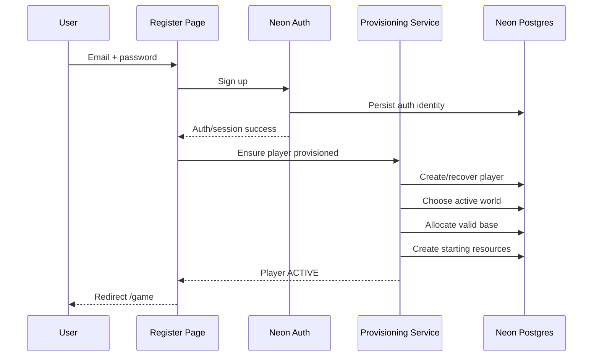

# 04 — Phase 1: Authentication and Base Spawn

## Goal

Build one production-worthy vertical slice:

> A user can register, receive a session, be provisioned into the active world, receive one valid random base, log out, log back in, and return to the same persisted base.

## Routes

```text
/
  public landing / entry

/register
  email
  password
  confirm password

/login
  email
  password

/game
  protected
  provision player if necessary
  show minimal base status
```

## Registration flow



## Important reliability rule

Auth and game provisioning are logically separate.

A failure to place a base must not corrupt auth.

`ensurePlayerProvisioned(userId)` is idempotent and is allowed to run:

- after registration
- on `/game` load
- after a transient database failure
- after a deployment/restart

## Provisioning state machine

```text
NO_PLAYER
  -> create player(PROVISIONING)
  -> assign active world
  -> allocate base
  -> create resource account
  -> set player ACTIVE
```

Any retry resumes from persisted state instead of creating duplicates.

## Base spawn validity

Candidate base must:

- belong to an enabled spawn region
- be inside world bounds
- be passable
- not overlap another base
- maintain configured base separation
- not overlap a cave/reserved feature
- be generated server-side
- be inserted transactionally
- handle concurrency collisions safely

## Draft Phase 1 tuning

```text
base_exclusion_radius = 12 tiles
spawn_attempt_limit = 40
```

These values are balance config, not hard-coded constants.

## Spawn algorithm

1. Load active world.
2. Select enabled spawn region weighted by spawn capacity.
3. Generate candidate x/y on server.
4. Evaluate deterministic terrain.
5. Reject blocked terrain.
6. Query nearby bases with indexed bounding box.
7. Reject if exact distance violates separation.
8. Reject reserved feature collisions.
9. Attempt unique base insert.
10. On concurrency collision, retry.
11. Create starting resource row.
12. Mark player active.
13. Commit.

## Minimal `/game` shell

Example information:

```text
PROJECT ASHFALL

BASE STATUS: ESTABLISHED
WORLD: ASHFALL-01
COORDINATE: 138, 742

ENERGY: 250
METAL: 150

World grid unlocks in Phase 2.

[LOG OUT]
```

## Phase 1 acceptance criteria

### Account creation
- valid new user registers
- invalid email rejected
- invalid password rejected
- duplicate registration returns safe message
- game code never handles/stores plaintext passwords

### Session
- valid login succeeds
- refresh preserves valid session
- logout ends active session
- unauthenticated `/game` access is rejected/redirected

### Provisioning
- exactly one player per auth user
- exactly one base per player
- base is server-generated
- rerunning provisioning creates no duplicate base
- concurrent registrations cannot share a base tile
- spacing rule is enforced
- starting resources are server-generated and persisted

### Recovery
- authenticated user with incomplete provisioning is repaired safely
- repeated retry never grants duplicate starting resources

### Tests
- coordinate validity unit tests
- seeded spawn tests
- collision/concurrency test
- provisioning idempotency integration test
- Playwright register -> game -> logout -> login -> same base test
